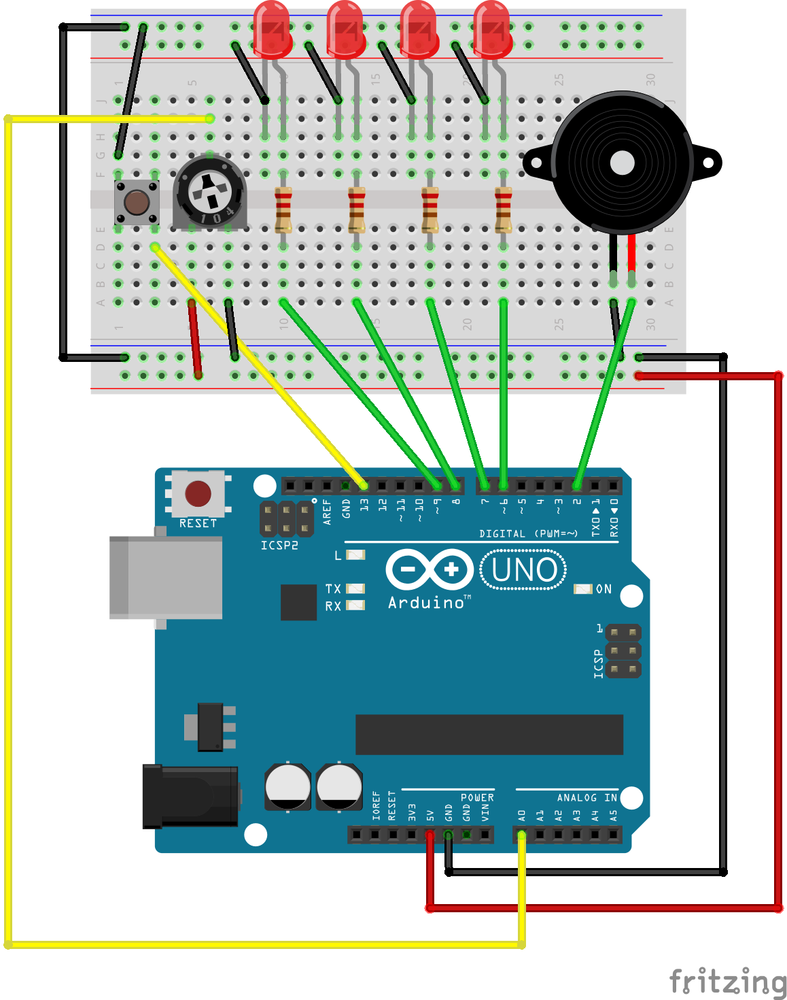
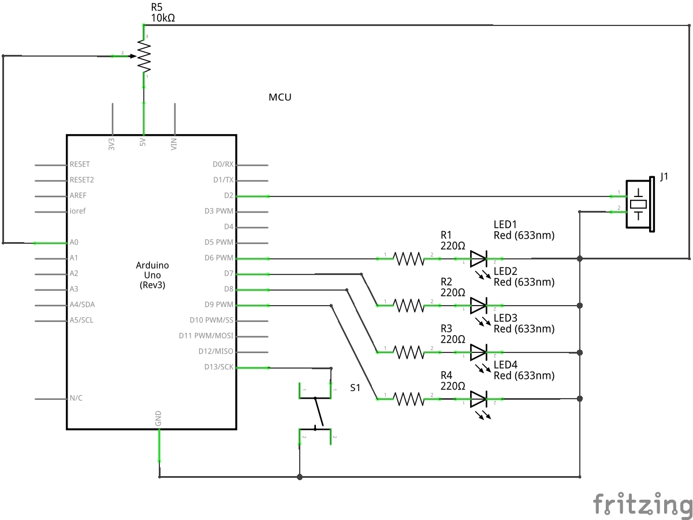

# Engine simulator

This is a small Arduino project based off [Aurum](https://github.com/uwburn/aurum) (Arduino Uno C API), inspired by William Moser video series on YouTube (https://www.youtube.com/watch?v=Zwbpi3B5_Go&list=PLlX-78ase7B9aQuT3hq_TvreMFOcmZQrm).

Unfortunately, no instructions were provided to replicate the setup, so i tried building my own.

The original setup was probably achieved by using some external oscillator for simulating engine firing sound.

As i had at hand an original Arduino starter kit, i tried to replicated that with what i had.

For space constraints on the starter kit breadboard, i limited to a 4 cylinders configuration, but it's easy to extend to different configuration.

I've included a button to switch engine configs and a potentiometer to change the RPMs.

## Layout

## Schematic

## Code

The code is rather straightforward, engine sound is simulated with tone function.

The only tricky part is mapping the phase angle to a 32 bit integer, for having a good enough resolution at high RPMs.